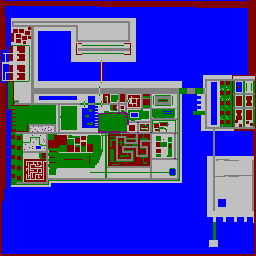

<HTML>
<BODY BGCOLOR="#000000" TEXT="#ffffff" LINK="#ffff80" VLINK="#80ffff">
<H1 ALIGN=Center>
  <BIG><BIG><A NAME=index>INDEX</A></BIG></BIG>
</H1>

<A HREF="#intro"><BIG><BIG><BIG>Introduction</BIG></BIG></BIG></A>

<A HREF="#install"><BIG><BIG><BIG>Installation</BIG></BIG></BIG></A>

<A HREF="#levels"><BIG><BIG><BIG>The Levels</BIG></BIG></BIG></A>

<A HREF="#bugs"><BIG><BIG><BIG>Known Bugs</BIG></BIG></BIG></A>

<A HREF="#conatact"><BIG><BIG><BIG>Contact
Information</BIG></BIG></BIG></A>

<BIG><BIG><BIG><A HREF="#thanks">Special
Thanks</A></BIG></BIG></BIG><SMALL><SMALL><SMALL> </SMALL></SMALL></SMALL>

<A HREF="#hi"><BIG><BIG><BIG>Hello to...</BIG></BIG></BIG></A> 
  

<H3>
  <A NAME=intro>INTRODUCTION</A>
  {..<A HREF="#index">INDEX</A>..}
</H3>

Welcome to the 99% complete TownFive version 0.99

Seeing as very few people will ever get this readme and version of the map
I'll make it simple to write for me and assume you arn't think (something
I will assume in the full version, congratutlations people your officially
not stupid &lt;g&gt;)

  

<H3>
  <A NAME=install>INSTALLATION</A>
  {..<A HREF="#index">INDEX</A>..}
</H3>

TownFive is realativly easy to get up and running. &nbsp;MAKE SURE TOWNFIVE
IS IN x:\your-gta-directory\townfive 
(where x is your hard disk letter and your-gta-directory is your gta directory
(duh!)).

The easy way 
Run the T5 bat files. &nbsp;They are t5-8bit.bat for low colour GTA. t5-24bit.bat
for High colour and t5fx.bat for 3dfx GTA.

The hard way 
Backup the files x:\your-gta-diectory\gtadata\ english.fxt, special.fxt
mission.ini

Now copy the files from the TownFive folder into x:\your-gta-directory\gtadata
and run the game replacing the backed up files when you've finished playing.

  

<B><A NAME=levels><BIG>THE
LEVELS</BIG></A><BIG> {..<A HREF="#index">INDEX</A>..}</BIG></B>

TownFive: Straight out TownFive with its 2missions (sorry due to the lack
theres a good chance I'll do an update soonish) 
Botmatch: My good ol' bots are back 
TownFive Nights: TownFive... at night!!!!

Map:

  

<H3>
  <A NAME=bugs>KNOWN BUGS</A>
  {..<A HREF="#index">INDEX</A>..}
</H3>

In mission 2 where you have to go and take the boss to outside the taxi station
sometimes the man you are supposed to meet isnt there and the arrow messes
around pointing in all directions. The problem here is sometimes the mission
works fine! I'm still working on this. 
In deathmatch some of the powerups don't open when you drive over them but
do when you hit them or shoot them. 
In mission 2 when you are driving the boss to his hidaway in the industrial
zone the game once crashed on me for an unknown reason.

The whole helicopter pickup thing in chapter 2 of TownFive and TownFive nights
doenst work yet it exits the game cos' it can't create the helicopter because
it can't make the blades appear. &nbsp;No-ones ever done this before (not
even in the full game) but I'm taking to DMA about getting it to work so
I can finish my pet GTA project with an original "bang".

The bots are stupid, can't do much about it its the games AI, therefore you
can trick them into walking into ponds e.t.c. to kill them.

  

<H3>
  <A NAME=thanks>SPECIAL THANKS</A>
  {..<A HREF="#index">INDEX</A>..}
</H3>

HKNY for the testing he did way back when this map first got underway. 
PBoy for general ideas and stuff that hes talked to me about at various points
in time 
DMA Design for such a kickass game 
and Schu for bringing us all the news on it 
Mouse &amp; Mugwum for the odd test here and there 

  

<H3>
  <A NAME=hi>HELLO TO</A>
  {..<A HREF="#index">INDEX</A>..}
</H3>

Morgan French 
PBoy 
Mugwum 
Mitch Millett 
Phil Calvert 
Mouse 
GTA Devil 
Tosh 
Schu 
HKNYC 
Jon Westal 
Mike Beech 
Groove 
Anyone else I missed out in the short time it has taken me to put this doc
togeather!
</BODY></HTML>
